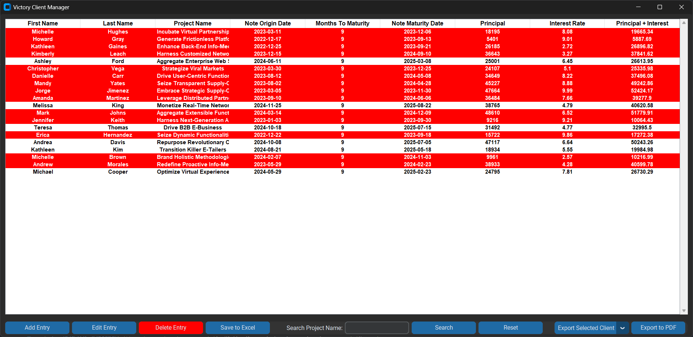

# Victory Client Manager

**Victory Client Manager** is a local, object‑oriented Python application that manages client investments. It uses **CustomTkinter** for a modern GUI, **pandas** for Excel data storage, **tkcalendar** for date picking, and **fpdf** for generating PDF letters. The code follows an **MVC architecture** with separate files for models, views, and controllers.

---

## Table of Contents

1. [Overview](#overview)  
2. [Features](#features)  
3. [Project Structure](#project-structure)
4. [Setup & Installation](#setup--installation)
5. [Example Images](#example-images)
---

## Overview

**Victory Client Manager** simplifies local investment tracking. It allows you to:

- **Add, Edit, Delete** client notes  
- Store data in **Excel**  
- **Highlight** notes near/past maturity in red  
- **Export** data to **PDF** letters per client  
- **Rollover** matured notes automatically  

This is well‑suited for small real estate investment tracking, or any scenario needing local data management with PDF reporting.

---

## Features

1. **MVC Architecture**  
   - **Model**: Loads/saves Excel data (pandas), interest & maturity calculations  
   - **View**: CustomTkinter GUI for user interaction  
   - **Controller**: Mediates logic between model & view

2. **Modern GUI** (CustomTkinter)  
   - Slider to pick **months to maturity**  
   - **Red row highlighting** for near/past‑due notes  
   - **DateEntry** for origin date

3. **PDF Letters**  
   - One PDF file **per client**: Named `firstname_lastname.pdf` in `output/` folder  
   - Letter style text summarizing the investment

4. **Excel Integration**  
   - Data stored in `investments.xlsx`  
   - Auto‑created if missing

5. **Rollover Logic** for Matured Notes  
   - Principal+Interest becomes new Principal  
   - New note starts day after old maturity date

---

## Project Structure
victory-client-manager/ ├── main.py ├── models.py ├── controllers.py ├── views.py ├── requirements.txt ├── output/ # PDF files go here └── investments.xlsx # Excel data (auto-generated if missing)


**File Details**:

- **`main.py`**: Application entry point, wires together Model, Controller, and View.  
- **`models.py`**:  
  - **`InvestmentModel`**: Handles the pandas DataFrame, load/save from Excel, calculations.  
  - **`export_rows_to_individual_pdfs()`**: Uses **fpdf** to generate letters.  
- **`controllers.py`**:  
  - **`InvestmentController`**: Logic for add/edit/delete, searching, exporting, rollover.  
- **`views.py`**:  
  - **`InvestmentApp`**: Main CustomTkinter GUI (the “view”).  
  - **`EntryWindow`**: Dialog for add/edit investments.  
- **`requirements.txt`**: Lists dependencies (customtkinter, pandas, tkcalendar, fpdf).  
- **`output/`**: Folder for exported PDF letters.  
- **`investments.xlsx`**: The Excel file storing your client data.

---

## Setup & Installation

1. **Clone or Download** the repository:
   ```bash
   git clone https://github.com/<YourUsername>/victory-client-manager.git
   cd victory-client-manager

## Example Images

